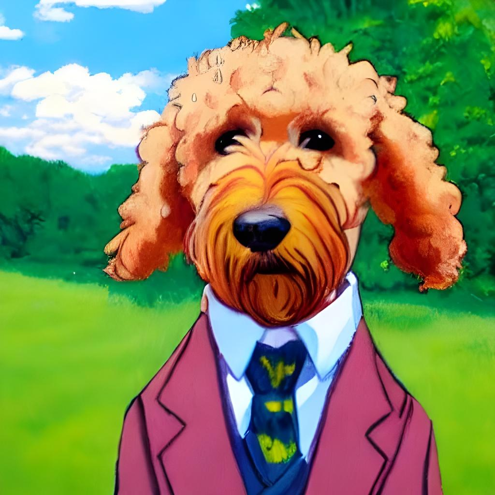

# 📃 Traslating Docs.

## 📌 intro
* "Stable Diffusion Prompt Book From OpenArt" 의 내용을 번역하였습니다.

---

## 📌 Prompt Format

1. 이미지 유형 : photo / a painting

2. 이미지의 피사체 :  Person, An animal, landscape?

3. 세부사항 추가

    - Special Lighting : Soft, ambient, ring light, neon
    - Environment :  Indoor, outdoor, underwater, in space
    - Color Scheme : Vibrant, dark, pastel
    - Point of view : Front, Overhead, Side
    - Background : Solid color, nebula, forest

</br>

4. 그림의 스타일 :  3D render, studio ghibli, movie poster

5. 사진의 타입 : Macro, telephoto

* 위와 같은 예시들이 있으며 다양한 시도를 해볼 것.

---

## ✨ Examples

- 다음과 같은 키워드로 작성해볼 수 있다.

    * 사진이나 그림의 경우 : painting

    * 사진의 주제 : a goldendoodle

    * 세부 사항 추가 : wearing a suit

    * 조명 효과 : natural light

    * 특정 스타일을 그림에 적용 : by Studio Ghibli

- 완성된 키워드 
    
    ```
    A painting of a cute goldendoodle wearing a suit, natural light, in the sky, with bright colors, by Studio Ghibli
    ```

- 생성된 이미지 
    

    - "in the sky" 가 적용되지 않음.
    - 문장의 순서에서 단어가 앞쪽에 있을수록 중요하게 평가

</br>

- 키워드를 다음과 같이 변경
    ```
    A painting of a cute goldendoodle in the sky, wearing a suit, natural light, with bright colors, by Studio Ghibli
    ```

    * "in the sky"를 첫 문장에 포함 시킨다.

</br>

- 단어를 하나로 압축하는 것보다 개별적으로 나열하는 것이 좋다.

---

## ✨ Modifier

- 상세 수정에 대한 내용은 아래 문서를 참고해주세요.
- [Modifiers 문서 이동](./[2]Modifier.md)
