# 📃 Modifier Docs.

## 📌 intro
* Stable Diffusion의 Modifier에 대하여 다룹니다.
* 이미지의 스타일에 대한 설명입니다.
* 특정 작가의 스타일은 제외했습니다.
* 성능을 올리는 Magic words에 대한 설명입니다.

---

## 📌 목차
- [photofraphy](#📷-photofraphy)
- [Art Mediums](#🧹-art-mediums)
- [Illustration](#🖌️-illustration)
- [Emotions](#😉-emotions)
- [Aesthetics](#🖼️-aesthetics)
- [Magic Words](#📌-magic-words)

---

## 🐼 같은 Prompt에서 Style만 변경한 예시

---

### 📷 Photofraphy
- 사진 효과를 적용합니다.
- 전체적인 내용을 표로 정리하면 아래와 같습니다.
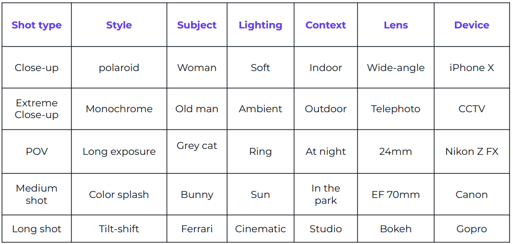

 

1. Photography Styles

    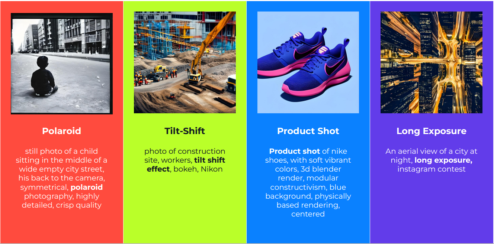
    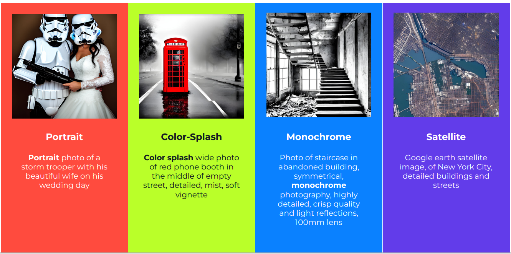

2. Cameras

    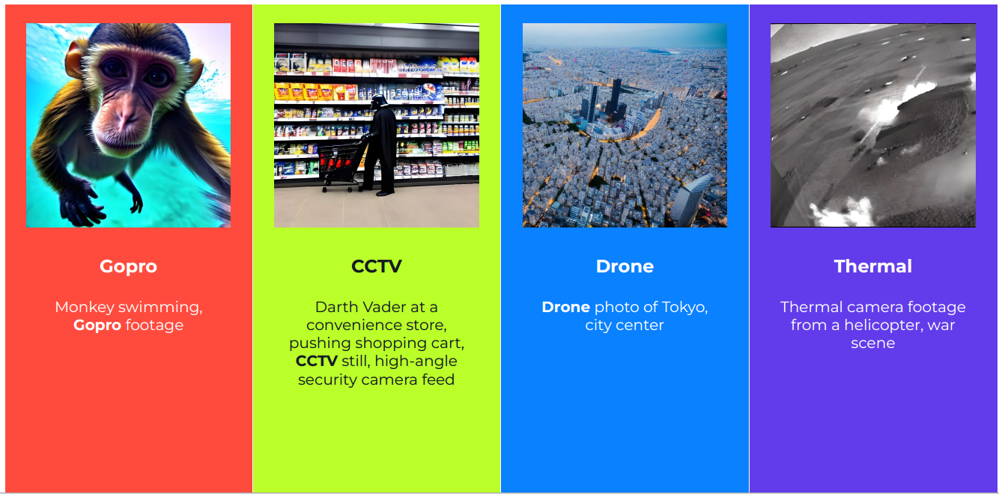

3. Lenses 

    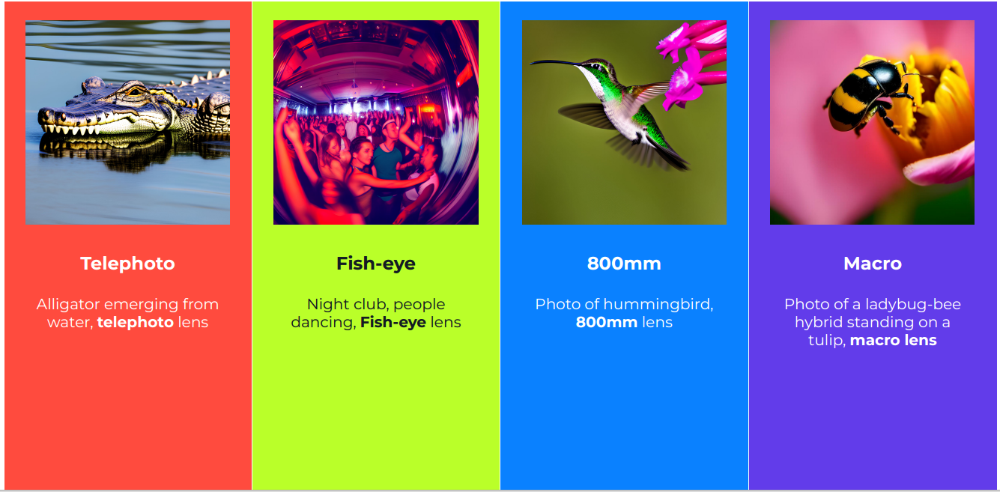

4. Lighting

    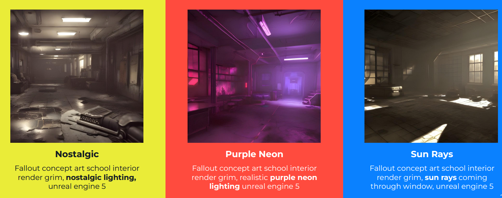

### 🧹 Art Mediums

- 여러 종류의 스타일 예시 
    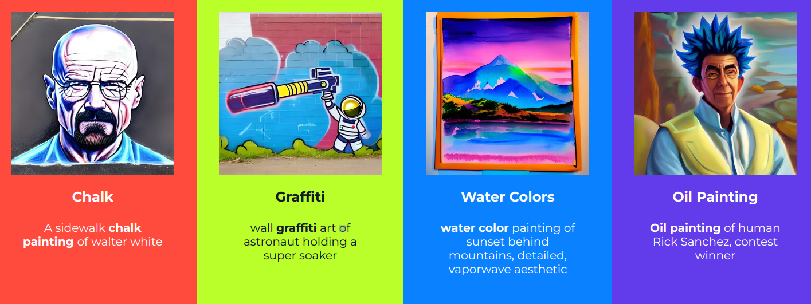
    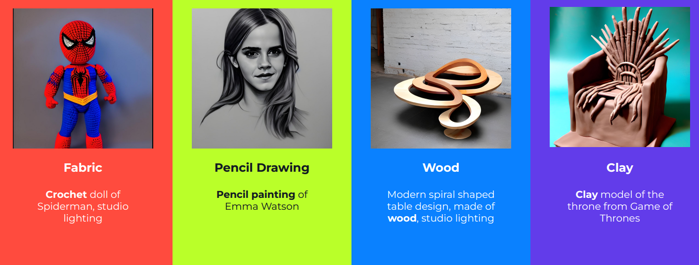

### 🖌️ Illustration

- 여러 종류의 스타일 예시
    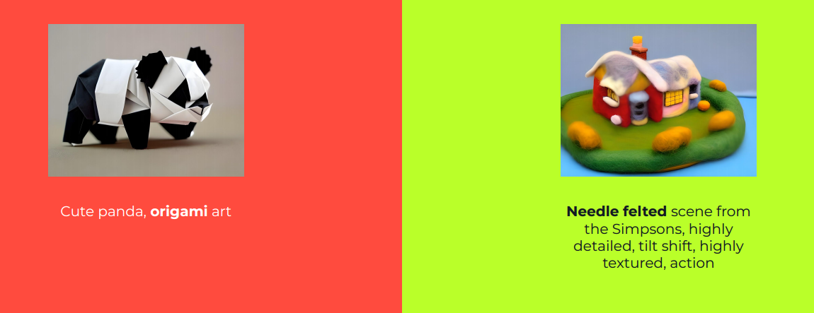
    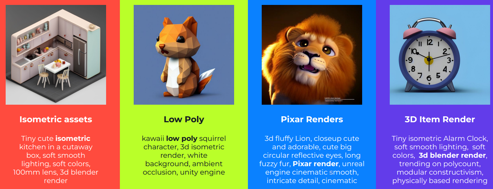
    
    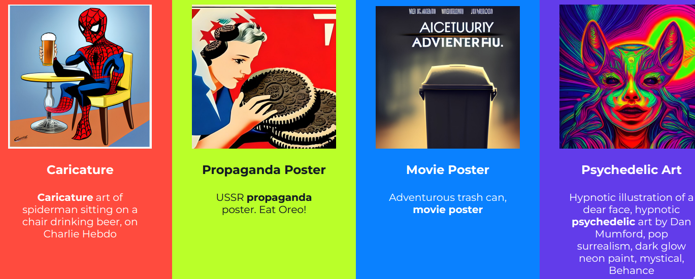
    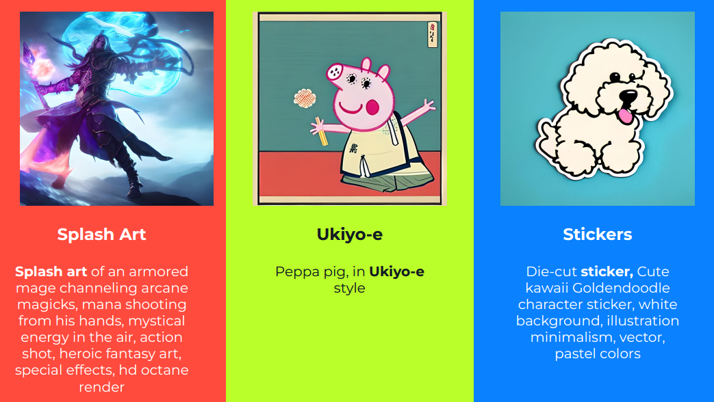

### 😉 Emotions

- Positive Emotion 예시
    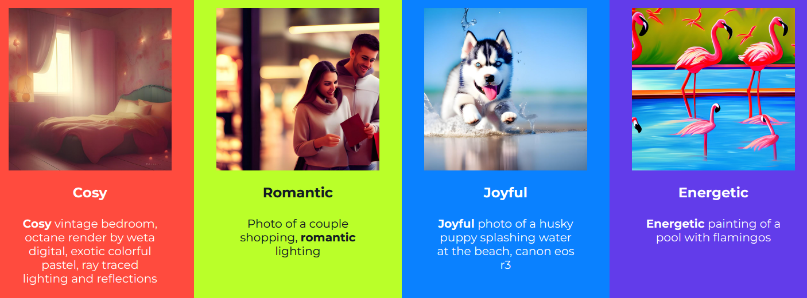
    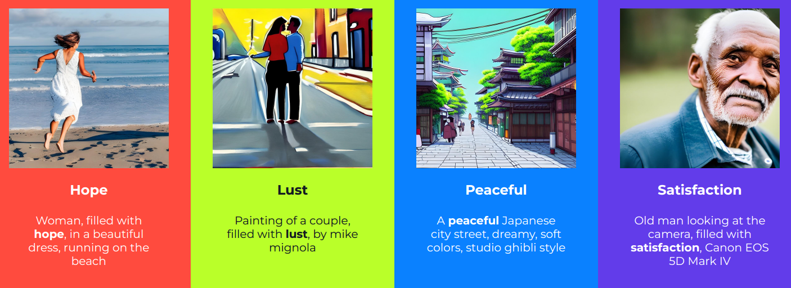

- Negative Emotion 예시
    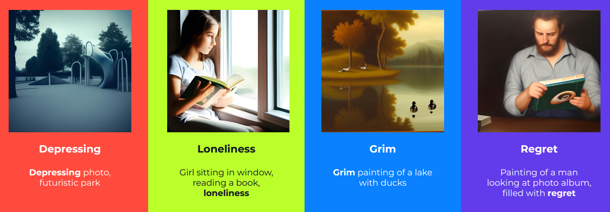
    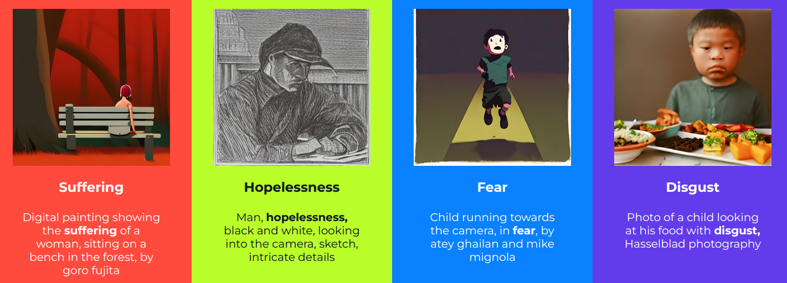

### 🖼️ Aesthetics

- Vibrant
    

- Gloomy
    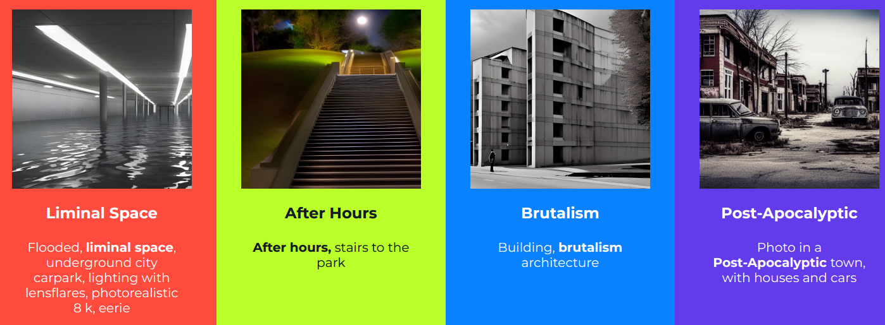

- Historic
    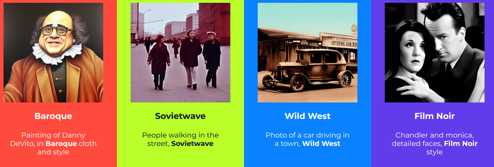

---

## 📌 Magic Words

- Magic Words는 이미지의 품질 개선에 도움이 되는 단어
- 예시의 몇가지이며 다양한 단어들이 존재

    - HDR, UHD, 64K
        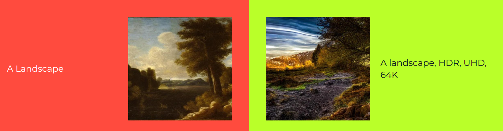
        
    - Highly detailed
        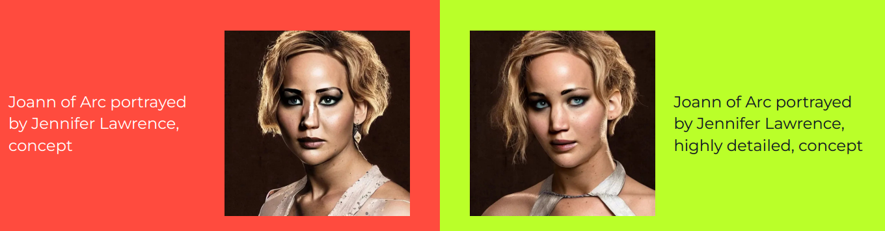

    - Studio lighting
        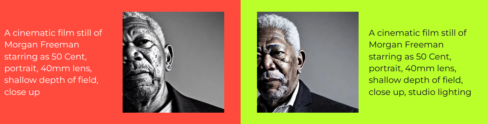

    - Trending on artstation
        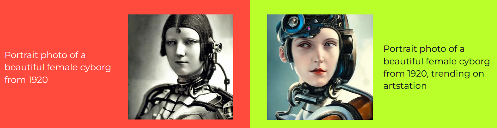

    - Unreal engine
        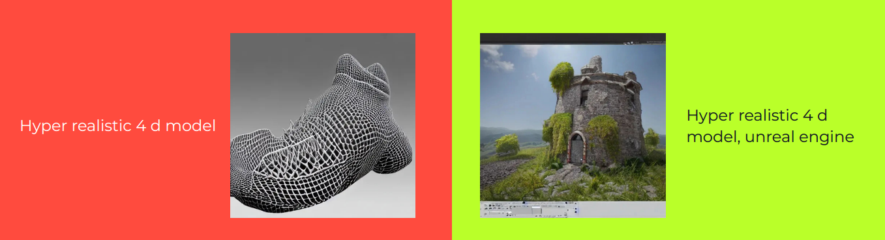

    - Bokeh
        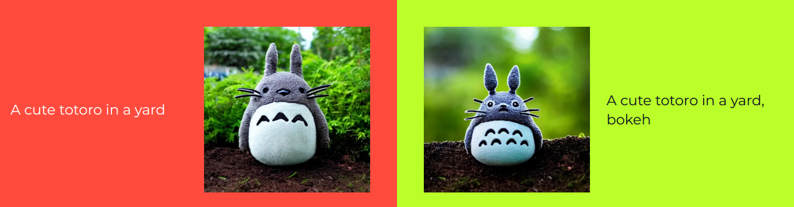

    - Sketch vs Painting
        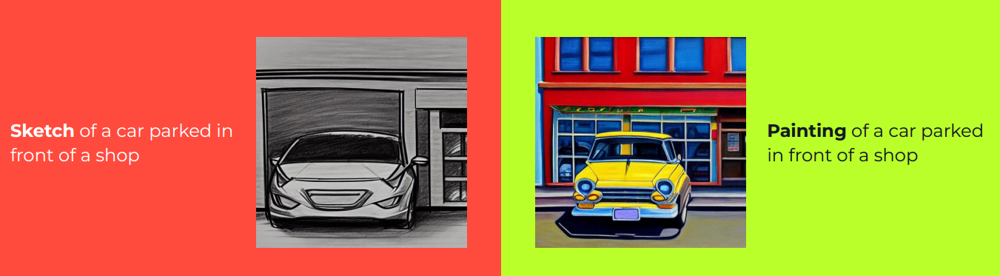

